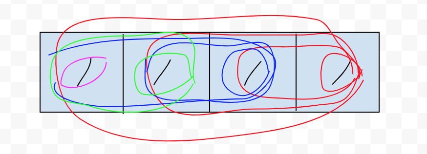
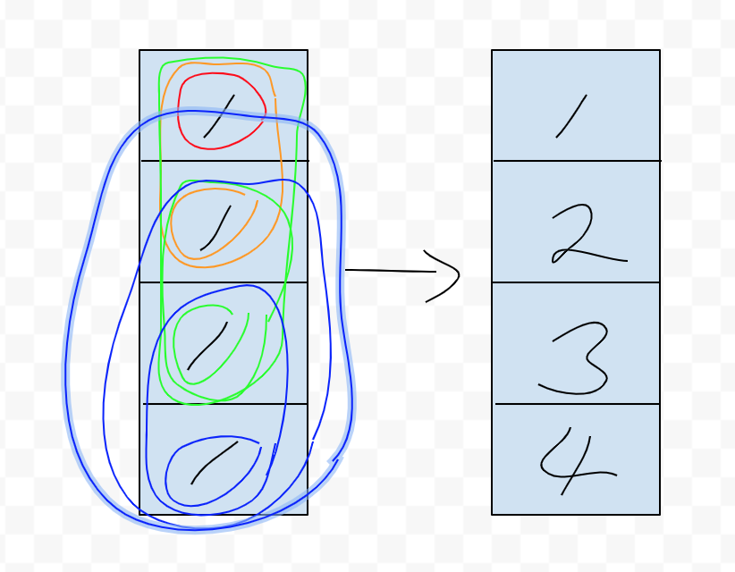
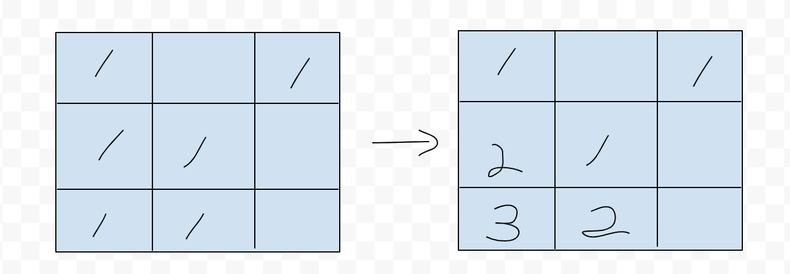

# [1504. Count Submatrices With All Ones](https://leetcode.com/problems/count-submatrices-with-all-ones/)

## Problem
- mat 이라는 가로 세로 배열이 주어짐
- 배열에는 0과 1이 존재함
- 배열에 1만 포함하는 서브매트릭스가 몇개인지 리턴

- Constraints:
  - 1 <= rows <= 150
  - 1 <= columns <= 150
  - 0 <= mat[i][j] <= 1

## Example
- example #1
```
Input: mat = [[1,0,1],
              [1,1,0],
              [1,1,0]]
Output: 13
Explanation:
There are 6 rectangles of side 1x1.
There are 2 rectangles of side 1x2.
There are 3 rectangles of side 2x1.
There is 1 rectangle of side 2x2. 
There is 1 rectangle of side 3x1.
Total number of rectangles = 6 + 2 + 3 + 1 + 1 = 13.
```

- exmaple #2
```
Input: mat = [[0,1,1,0],
              [0,1,1,1],
              [1,1,1,0]]
Output: 24
Explanation:
There are 8 rectangles of side 1x1.
There are 5 rectangles of side 1x2.
There are 2 rectangles of side 1x3. 
There are 4 rectangles of side 2x1.
There are 2 rectangles of side 2x2. 
There are 2 rectangles of side 3x1. 
There is 1 rectangle of side 3x2. 
Total number of rectangles = 8 + 5 + 2 + 4 + 2 + 2 + 1 = 24.
```

## Basic idea
- 행의 관점
  - x 좌표가 n 에서 0 으로 이동

  - (x, y) 좌표 기준 0이 있는 경우는 무시
  - (x, y) 좌표 기준 왼쪽으로 1이 하나만 있는 경우
    - 만들수 있는 매트릭스는 1개
  - (x, y) 좌표 기준 왼쪽으로 1이 연달아 있는 경우 
    - 만들수 있는 매트릭스는 1+1+... = n
  => x 좌표를 이동하며 나올수 있는 갯수를 합산
- 열의 관점
  - y 좌표가 0 에서 n 으로 이동

  - (x, y) 좌표 기준으로 1이고 y-1 이 0 인 경우
    - 만들수 있는 매트릭스는 1
  - (x, y) 좌표 기준으로 1이고 y-1~ y-n 이 1 인경우
    - 만들수 있는 매트릭스는 1+1+... = n
    - 단 해당 좌표의 값을 n 으로 변경하여 row 연산
- n행의 연산

  - 첫 행은 행의 관점으로 연산
  - 두번째 행부터는 y-1 의 값과 합한값으로 y 를 업데이트 하여 행을 연산
  - (x, y) 좌표의 값의 최소값을 1이 존재하는 구간동안 합산

## Code
```java
public class Solution {
    public int numSubmat(int[][] mat) {
        final int row = mat.length;
        final int col = mat[0].length;
        int res = 0;
        for (int y = 0; y < row; y++) {
            for (int x = 0; x < col; x ++) {
                if (mat[y][x] == 0) {
                    continue;
                }
                if (y > 0) {
                    mat[y][x] += mat[y-1][x];
                }
                int min = Integer.MAX_VALUE;
                for (int i = x; i >= 0 && mat[y][i] != 0; i --) {
                    min = Math.min(min, mat[y][i]);
                    res += min;
                }
            }
        }
        return res;
    }
}
```
