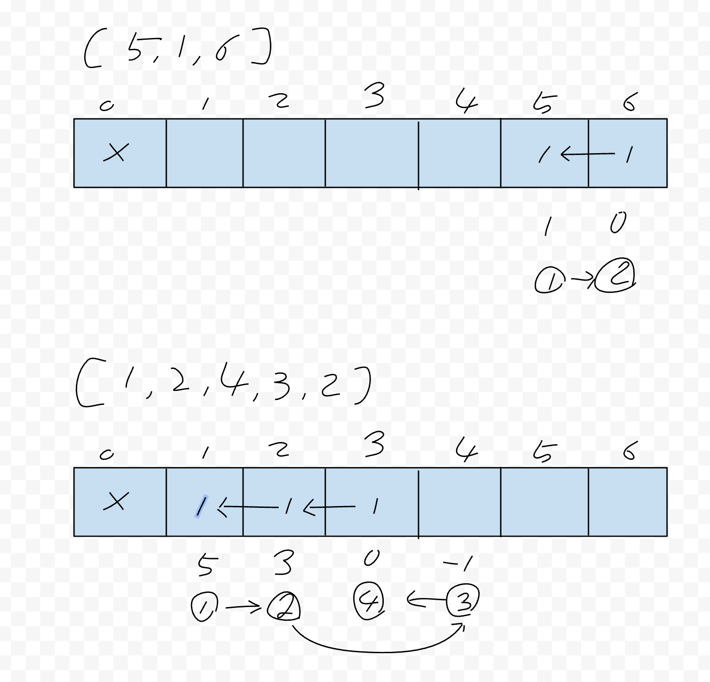

# [416. Partition Equal Subset Sum](https://leetcode.com/problems/partition-equal-subset-sum/)

## Problem
- 1개 이상의 0보다 큰 수를 가진 nums 배열
- 두개의 파티션으로 나눠 두개의 subset 의 합이 동일한지 여부를 리턴

### Example 1
```
Input: nums = [1,5,11,5]
Output: true
Explanation: The array can be partitioned as [1, 5, 5] and [11].
```

### Example 2
```
Input: nums = [1,2,3,5]
Output: false
Explanation: The array cannot be partitioned into equal sum subsets.
```

### Constraints
```
1 <= nums.length <= 200
1 <= nums[i] <= 100
```

## Basic idea
- 두개로 나눠 합이 동일하다는 것은 모두의 합이 짝수여야 함
  - 홀수인 경우 무조건 false 리턴
- 두개로 나눴단 것은 전체 합의 1/2 의 값을 찾아내면 됨
- 합의 값을 기준으로 backtracking 검색을 통해 전체 검색
  - 단, 전체 검색시 timeout이 발생되므로 monoization 을 통해 이미 연산된 곳은 캐쉬 처리


## Code 
```java
public class Solution {
    public boolean helper(int[] nums, int pos, int sum, int[] dp) {
        if(sum == 0)
            return true;
        if(pos == nums.length || sum < 0)
            return false;

        if(dp[sum] != 0)
            return dp[sum] == 1;

         for(int i = pos; i < nums.length; i++) {
             if(nums[i] <= sum && helper(nums, i+1, sum-nums[i], dp)) {
                 dp[pos] = 1;
                 return true;
             }
         }
         dp[sum] = -1;
         return false;
    }

    public boolean canPartition(int[] nums) {
        int sum = 0;
        for(int num: nums) 
            sum += num;
        if(sum%2 == 1)
            return false;
        sum /= 2;

        return helper(nums, 0, sum, new int[sum+1]);
    }
}
```
