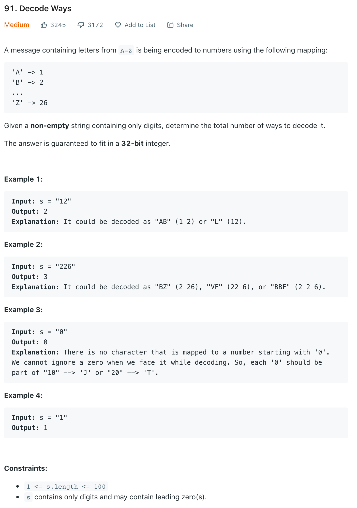

# 91. Decode Ways

## Problem


## Basic Idea
- *s* 에 포함된 숫자를 맵핑된 영문자로 변환할수 있는 가짓수를 리턴
- 기본적으로 계단을 2개 혹은 1개 오르는 경우의 수를 찾는 문제와 유사
  - 이전의 경우의 수와 그 이전의 경우의 수를 합한 값이 현재 위치의 경우의 수
  - `dp[i] = dp[i-2] + dp[i-1]`
- 본 문제의 제약은 경우의 수를 계산하는 제약은 26보다 크면 안되고, 0으로 시작하는 경우는 불가
  - Edge case 
    - 0 으로 시작하면 무조건 0 리턴
  - 처리 과정중 경우의 수`x : 0 이외의 수 - 1 ~ 9`
    - case #1 - 00 : 무조건 0 리턴 `ex) 100`
    - case #2 - 0x : 앞의 경우의 수를 따른다. `ex) 101`
    - case #3 - x0 : 두수가 27 보다 작으면 1, 그보다 크면 0 `ex) 10, 30`
    - case #4 - xx : 두수가 27 보다 큰경우 1, 작으면 2  `ex) 37, 12`
- 두개의 문자중 한개씩을 개별적으로 처리
  - `s[i-1]` 을 `dp[i-1]` 에 대응하여 `dp[i]`에 저장
    - `s[i-1]` 이 `0`이 아니면 `dp[i-1]`의 값을 `dp[i]`에 저장 - case #2, case #4
  - `s[i-2]` 을 `dp[i-2]` 에 대응하여 `dp[i]`에 저장
    - `s[i-2]` 이 `0`이 아니고 27보다 작은경우 `dp[i-1]`의 값과 `dp[i]`을 합산하여 저장 - case #3, case #4
  - `dp[i]` 가 0 인 경우는 `s[i-1]` 이 0 이고 `s[i-2]` 가 0 혹은 둘의 합이 26 보다 큰 경우이므로 0 리턴

## Code
```java
class Solution {
    public int numDecodings(String s) {
        int[] dp = new int[s.length()+1];
        if(s.charAt(0) == '0')
            return 0;
        dp[0] = 1;
        dp[1] = 1;
        for(int i = 2; i < dp.length; i++) {
            int v = (s.charAt(i-2)-'0')*10+(s.charAt(i-1)-'0');
            if(s.charAt(i-1) != '0')
                dp[i] += dp[i-1];
            if(s.charAt(i-2) != '0' && v <= 26)
                dp[i] += dp[i-2];
            if(dp[i] == 0)
                return 0;
        }
        return dp[dp.length-1];
    }
}
```

## Reference


